.. index:: CwInst

.. _Jennic Suite Install:

Installing Jennic Developement Suite
************************************

| **This small guide is intended to explain the main steps to properly install the Jennic SDK Toolchain.**
| **As possibly not shown here, refer to the document JN-UG-3064.**
| **All steps here described are performed with WINDOWS 7 OS**

First step
----------

Unpack the file 'Install.zip' that you have downloaded
You must find these files:

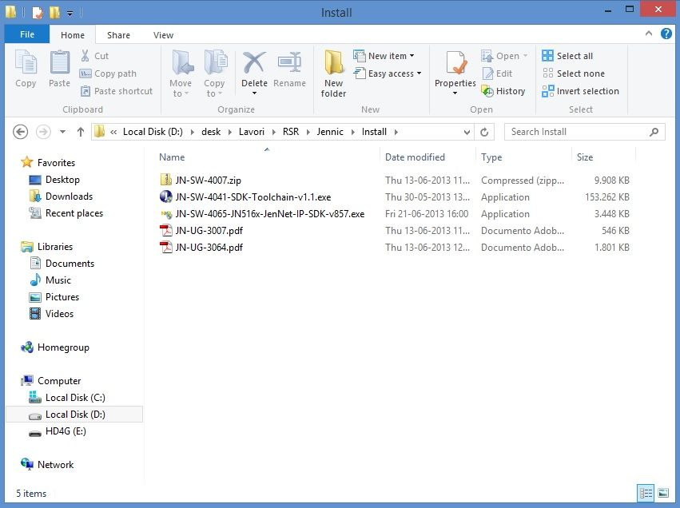

Then, you are ready for Jennic Developement Suite setup.

Installing Jennic Toolchain JN-SW-4041
--------------------------------------

| Double click on **JN-SW-4041-SDK-Toolchain-v1.1.exe**.
| Leave unchanged all default setting in the following dialog box.
| When appear verify checkbox selection as image below

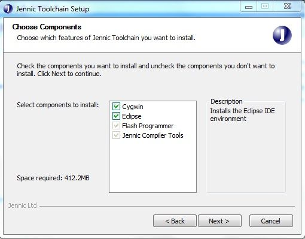

During installation, if you don't have Java Runtime on your PC, this popup will appear:

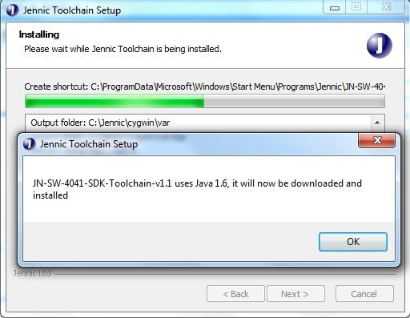

Click OK button and proceed following Java Installer instructions

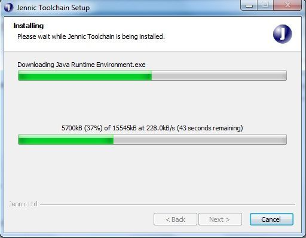

When installation ends, the followiong will appear:

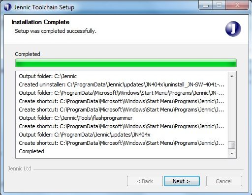

click "next" button, and setup will ask you to perform a system restart

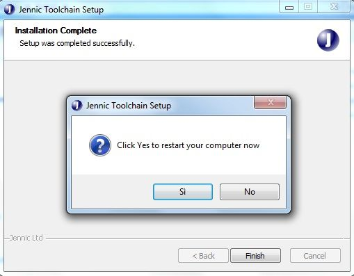

click "OK" and wait for restart

Installing JN-AN-4065 library
-----------------------------

| Double click on **JN-SW-4065-JN516x-JenNet-IP-SDK-v857.exe**.
| Leave unchanged all default setting in the following dialog box.
| When appear verify checkbox selection as image below, then click "Next"

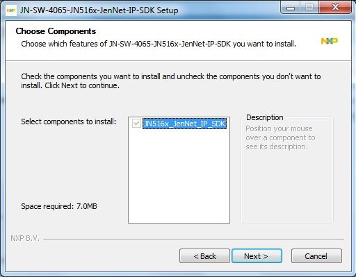

When library installation has finished, Jennic Toolchain is ready to start

Starting Jennic Toolchain
-------------------------

| Open Start and go to Jennic --> Eclipse (as show in figure below)
| click on Eclipse to start program

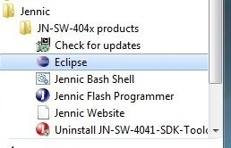

Jennic Toolchain will ask for workspace. Leave unchanged an click "OK"

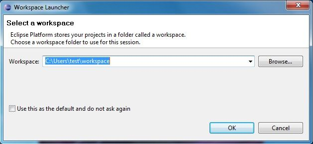

Jennic Eclipse will open Welcome tab.

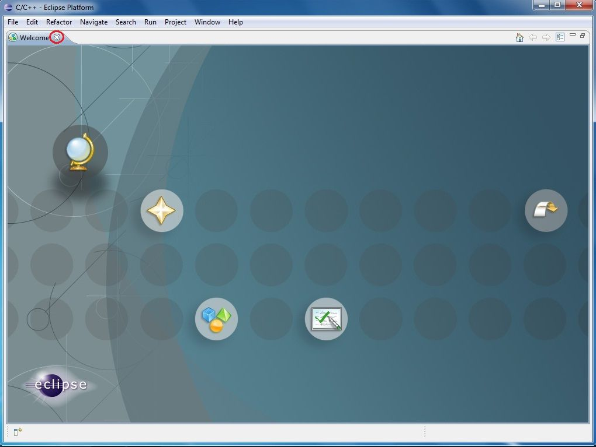

| Close Welcome tab by clicking on X red circled in figure above
| Now the Jennic Eclipse main window will appear

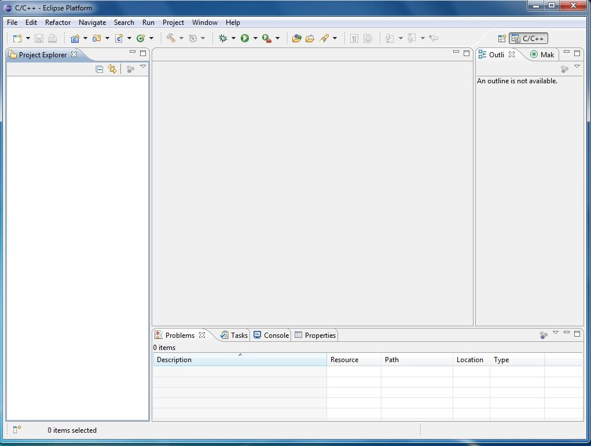

Close Eclipse and proceed with next steps.

Installing Flash GUI Tool Programmer
------------------------------------

| In order to complete developement suite setup, you must install Flah Programmer as a external tool.
| Open file menu, and select "Import"

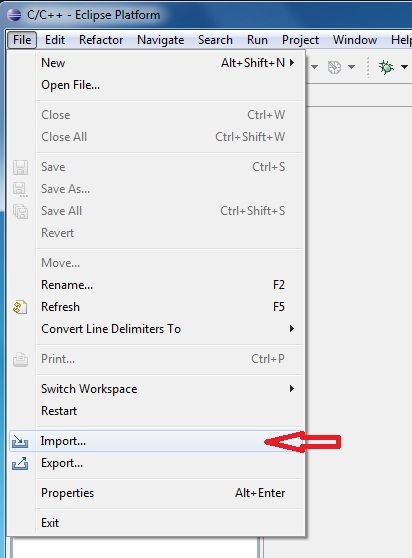

chose "Run/Debug --> Launch Configurations and click "Next" button

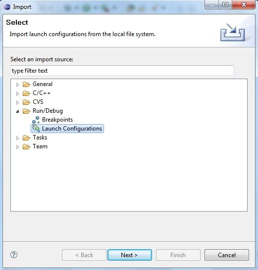

click "Browse" button and navigate to **C:\\Jennic\\Tools\\eclipse_config** and then click "OK"

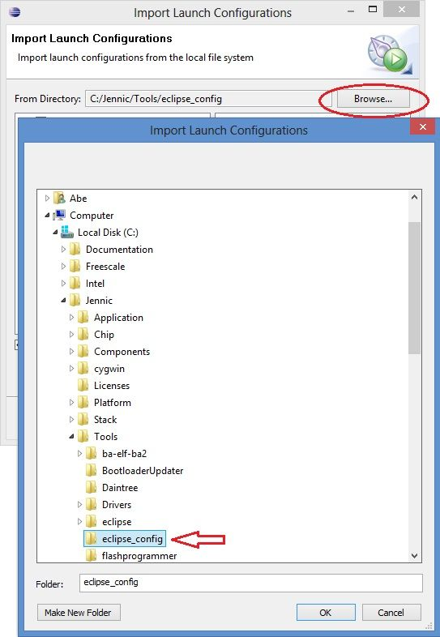

| Sign "Flash GUI Tool" and "Flash CLI Tool" checkbox 
| Please, note that Eclipse default is all tool checked, but as actual for JN5168 application only the two Flash tool are needed.

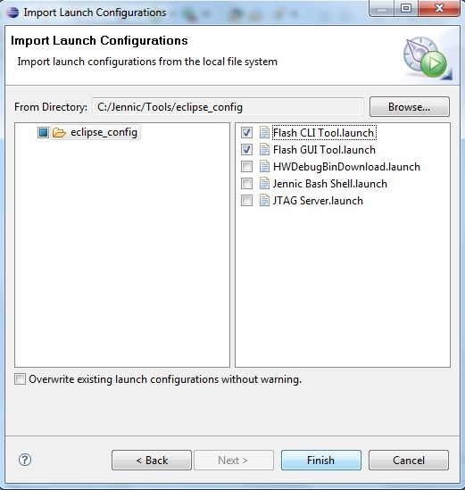

| Click "Finish" button to perform Flash Tools setup. 
| When finished, you can find the tools in the Run-->External Tools menu
| They can also be accessed from the drop-down arrow next to the tools symbol, as show in figure below

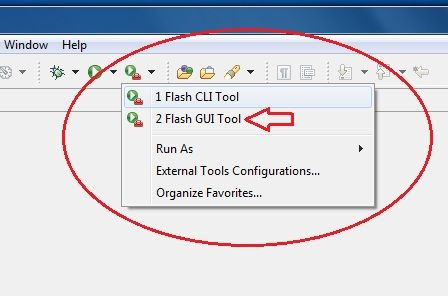

.. _progup:

Upgrading Flash GUI tool (for JN5168)
-------------------------------------

| We must upgrade Flash GUI tool to release 1.8.9, because the tool just installed does'n work with JN5168.
| To make this, unpack the zip file JN-SW-4007.zip into new folder and navigate to **Tools\\FlashProgrammer** located inside this new folder.
| *you can find the JN-SW-4007 file inside Install.zip as show in* **First step** *chapter on this document*

 .. image:: _jn_images/flash_update_2.jpg
 
| Select all files, right click an copy.
| Open folder **C:\\Jennic\\Tools\\flashprogrammer** and **paste** all file inside this folder.

 .. image:: _jn_images/flash_update_3.jpg
 
**Now Jennic Eclipse setup is complete and the suite is ready for work with Wise Project!**

| 
| 
| 

.. _ftdixp: 

**WINXP TROUBLESHOOTING**
*************************

INSTALLING DRIVER FOR USB DONGLE
--------------------------------

With some release of Windows Xp, you must manually install the USB drivers of the Wise board.

 .. image:: _jn_images/winxp.png
 
In this case, go to `FTDI driver page <http://www.ftdichip.com/Drivers/D2XX.htm>`_ download and install Windows driver.

CYGWIN1.DLL TROUBLES WITH WINXP
-------------------------------

| Jennic SDK Toolchain install CygWin API inside the folder C:\\Jennic\\cygwin.
| Some XP installation have the file "cygwin1.dll" inside C:\windows\system32 folder.
| This is a cause for fatal error during project building.
| If it occours, build fails and on the "Console" tab of the Jennic Eclipse you can see one or more messages as follow:

::

 290 [main] ? (680) c:\Jennic\Tools\ba-elf-ba2\bin\ba-elf-gcc.exe: *** fatal error - cygheap base mismatch detected - 0x611668E0/0x611688E0.
 This problem is probably due to using incompatible versions of the cygwin DLL.
 Search for cygwin1.dll using the Windows Start->Find/Search facility
 and delete all but the most recent version.  The most recent version *should*
 reside in x:\cygwin\bin, where 'x' is the drive on which you have
 installed the cygwin distribution.  Rebooting is also suggested if you
 are unable to find another cygwin DLL.

| **To solve this trouble with Jennic Eclipse Builder, we suggest to try to remove file "cygwin1.dll" located inside folder C:\\Windows\\system32**
| *We suggest to rename the file in your system folder and check if there are no other troubles*
| Be careful if you have other applications that use cygwin!! Removing file from OS system folder must be checked before.
| For more detail and further information regarding cygwin, you can visit the `cygwin <http://cygwin.com/>`_ site.
| For further information about this trouble, click `here <http://cygwin.com/ml/cygwin/2013-01/msg00012.html>`_ .

