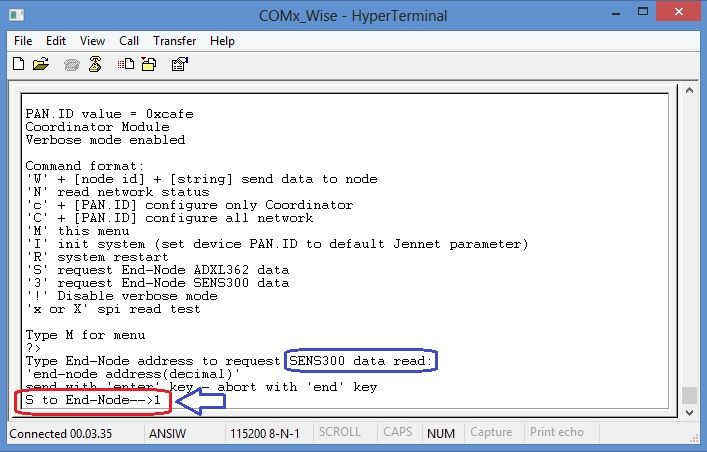

.. _monitor:

Serial Monitor guide
********************

Using serial monitor
====================

| You can use USB built-in dongle on Wise Board for programming or Serial Monitor purpose.
| The only attention is that you must "deselect" COM port in the Flash GUI Tool (or close program) before connect with Terminal (i.e. HyperTerminal)
| This is because the same COM port is used by Flash Programmer and (when application firmware starts) by Serial Monitor.
| *Example: if your Wise Board is connected to COM4, if possible, change COM Port settings in Flash GUI Programmer BEFORE attempting to connect HyperTerminal*
| Best way is to close NXP Flash GUI Tool before connect Terminal to device COM port. 

.. note:: Startup messages are same in End-Node and Coordinator

Coordinator Serial Monitor
==========================

When Coordinator is power up, it sends (in sequence):

and after starts main menu as follow:

.. image:: _jn_images/coord_menu.jpg

**Serial Monitor main messages and commands**

- End-Node detected and associated

- End-Node poll fail and dissociated (details orange circled)

- Send data to End-Node (**"w" command**)

| - Sendig data to End-Node result
| Red circled: detail of data message
| Blue circled: sending End_Node address
| Green circled: data string hex format
| Yellow circled: data string terminator (same for all data sending)
| Orange circled: Data sending result

.. important:: In the Coordinator Monitor **W** command will send a "string" to a selected End_Node. You can see the received message inside End_Node Serial Monitor addressed by Coordinator 

- Network status (**"n" command**)

- Set Coordinator PAN.ID (**'c' command**)

Please, note that **'c'** command (lowercase) set only coordinator PAN.ID. To configure all network PAN.ID, use **'C'** command (uppercase)

- Set network PAN.ID (**"C" command**)

| - See image below:
| Red circled: detail of PAN.ID configuration message 
| Blue circled: PAN.ID message status
| Green circled: PAN.ID network global settings

*after system restart*

- Default PAN.ID (**"i" command**)

- Request End-Node ADXL362 data (**"s" command**)

- Received End-Node ADXL362 data

- Request End-Node SENS300 data (**"3" command**)

- Received End-Node SENS300 data

.. important:: **All sensors data are transmitted in 32 bit HEX format, without any conversion in ASCII format. Values are position dependent, and must be read scanning the data string received**

.. note:: In the Coordinator Monitor **S** and **3** command will answers a selected End_Node to read and send sensor data. You can see sensor data both in End_Node monitor and Coordinator monitor 

- Disable verbose mode

.. note:: In the Coordinator Serial Monitor, verbose mode is also set by SerizII. With verbose mode disabled, Serial Monitor messages are limited to data string and few other information. Check by yourself this operation mode.

End-Node Serial Monitor
=======================

- End-Node main menu

- Coordinator found, End-Node association

- Coordinator lost, End-Node dissociation

- Set data to send to Coordinator (**"w"** command)

| - Data sending
| Blue arrow: string to send
| Orange circled: hex string format
| Red circled: End-Node address that send the message
| Blue circled: Data sending result

- End-Node network status (**"n"** command)

- End-Node ADXL362 data sending (**"s"** command**)

- End-Node SENS300 data sending (**"3"** command)

- End-Node Auto Send Sensors Data toggle (**"!"** command)

disable auto send

enable auto send

- End-Node Sleep Mode

.. important:: **In End-Node module, configuration command "c" perform only local device PAN.ID settings. If you use this command, End-Node will dissociate himself until it find a Coordinator with same new PAN.ID**