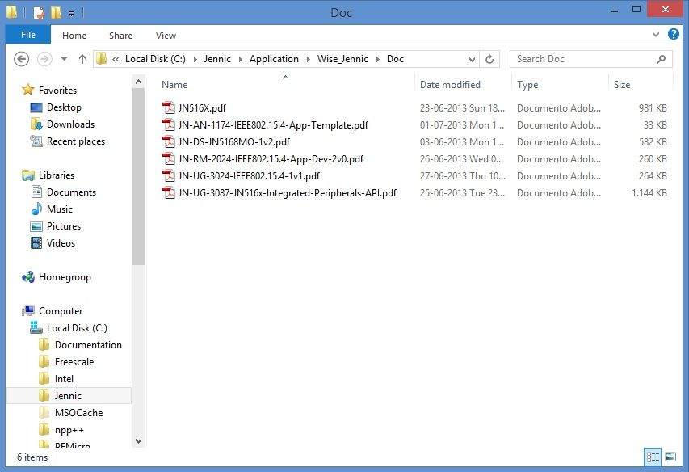
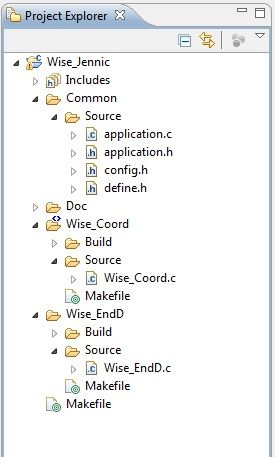

.. index:: PrjFiles

Firmware specification
**********************

Firmware overview
-----------------

| The Wise_Jennic firmware has been developed using **JN-AN-1174-JN516x-802-15-4-Application-Template** skeleton code.
| This template include basic application of IEEE802-15-4 stack and some callback function that can be personalized and help end-user application development.
| More detail regarding the structure of this template can be found on document "JN-AN-1174-IEEE802.15.4-App-Template.pdf" inside "Doc" folder included in Wise_Jennic zip file

| JN-AN-1174-IEEE802.15.4-App-Template.pdf reference manual refers to other documents in this folder, especially for: 
| **IEEE 802.15.4 Wireless Networks User Guide (JN-UG-3024)**
| **IEEE 802.15.4 Application Development Reference Manual (JN-RM-2024)**

This is the complete set of guides to know the structure and operation of the skeleton code contained in the template

| Other documents:
| **JN-UG-3087-JN516x-Integrated-Peripherals-API.pdf** JN516x integrate peripherals API user guide (hardware library functions details) 
| **JN-DS-JN5168MO-1v2.pdf** JN5168 module hardware manual

**JN516X.pdf** JN5168 wireless microcontroller data sheet.

Firmware restrictions
---------------------

| The application skeleton assumes the following restrictions (directly derived from JN-AN-1174 Application Template):
| • You have one device which will act as the PAN Co-ordinator.
| • You have at least one other device which will act as an End Device.
| • You will use pre-determined values for the PAN ID and the short addresses (for the PAN Co-ordinator and for the End Device(s)).
| • The network topology will be a Star network.
| • The network will be non-beacon enabled (meaning that the PAN Co-ordinator will not transmit regular beacons).
| • Short addressing will be used.
| • Data transfers will be direct transmissions with acknowledgements.
| • There will be no security implemented.

Main firmware features
----------------------

Wise_jennic firmware is based on IEEE802.15.4 network stack. The application also features a serial monitor which, with simple control commands, allows you to evaluate the status of the network and perform basic functions of data transmission / reception.
The network topology is a "star", with one Coordinator and more End-Node.
The coordinator accepts up to a maximum of 8 End-Node, assigns them a short address and operates a regular polling of all devices associated to check your status. When a End-Node poll fails for 4 next times, the node is automatically dissociated from the Coordinator. Similary, when End-Node doesn't receive poll and the polling timeout is expired, dissociates itself automatically and restarts the scan sequence to search for a coordinator.
This is needed because that the network stack IEEE802.15.4, included in the JN-SW-4065 libraries, doesn't seem manage orphan devices.
In other words, this mode of operation (polling) allows for constantly monitoring the status of the network and update the presence or absence of networked devices.

Wise Board End-Node firmware implements a demonstration of Low Power functionality. Using Serial Monitor command 'Z', you can place the board in "sleep mode".
As a result, Serial Monitor will be disabled, and any Serial Monitor commands will not performed when board is in sleep mode. Please note that restart is the only way to exit from sleep mode. 

Project structure
-----------------

The application’s file structure includes the following folders:

• Wise_Coord – contains source files and makefiles for the PAN Co-ordinator
	• **Wise_Coord.c** specific application file for Coordinator functions (see chapter 3.2.1 of "JN-RM-2024" resource manual for main details)
	
• Wise_EndD – contains source files and makefiles for an End Device
	• **Wise_EndD.c** specific application file for End-Node functions (see chapter 3.2.2 of "JN-RM-2024" resource manual for main details)

• Common – contains:
	• **application.c** common functions used both by coordinator that end-node
	• **application.h** common functions and variables global definition
	• **define.h** common costant defines
	• **config.h** network parameter and macro definition
	
	
Firmware & documents download
-----------------------------

Firmware project file Wise_Jennic.zip, installation file Install.zip and all other documentation for the Wise project can be found at Silica ArchiTech page. Registration is needed to access at download section.
Click `here <http://www.silica.com/architech.html>`_ to go to ArchiTech main page.

