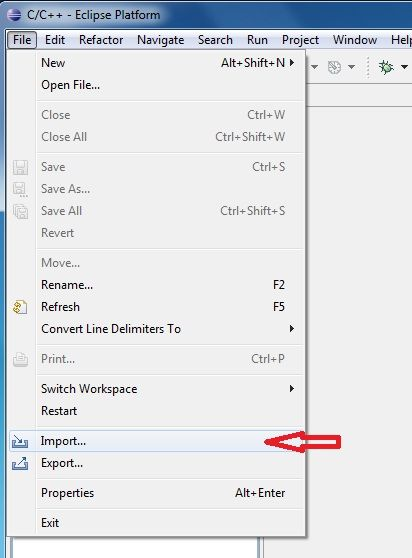
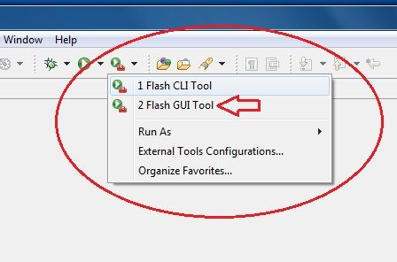

.. _quick:

Quick start guide
*****************

Hardware requirements
---------------------

- Silica Wise Board kit 
- One or more USB type-A extension cable 
- PC with terminal software (such as HyperTerminal)

Software requirements
---------------------

- Jennic SDK toolchain (JN-SW-4041), JN5168 stack library (JN-SW-4065) and Flash GUI tool (JN-SW-4007)
- Wise_Jennic firmware 
- PC terminal emulator (such as HyperTerminal)

.. note::

 | **If you have not yet installed Eclipse Jennic, before proceeding, go to:**
 | :ref:`Jennic Suite Install`

Hardware setup
--------------

Plug Wise Board into USB port (also using USB type-A extension cable)

with USB type-A extension cable

Wait for properly USB dongle driver installation

When drivers are ready you can connect one or more Wise Board (at least two for firmware evaluation)

.. tip::

 | **See Control Panel of your PC and note COM Port number configured for each Wise Board (figure above).**
 | For any troubles during USB driver installation in Windows XP see at :ref:`ftdixp`

*Connecting two Wise Board (minimun number for full firmware evaluation), take care at COM number installed on your PC*

.. _seriz:

SerizII plugin
==============
Wise board has in bottom layer two strip (6 an 4 way) and can be used as a plugin for SerizII. 

**Take care plugging Wise on SerizII: be shure that both boards (Wise and SerizII) are power off before!!**

.. _hyper:

HyperTerminal settings
----------------------

Set your HyperTerminal COMx parameter:

| speed = 115200 baud
| data with =  8
| parity = none
| stop bit = 1
| flow control = none

In Ascci Setup windows, check "Send line ends with line feeds"

Wise Board FW installation & setup
----------------------------------

- In the folder C:\\Jennic\\Application create new folder named **Wise_Jennic** 

- Unzip all files from Wise_Jennic_1_0_0.zip into the folder **C:\\Jennic\\Application\\Wise_Jennic** just created 

.. image:: _jn_images/folder.jpg 

- Go to Start --> Jennic --> JN-SW-404x products --> Eclipse and click on to start Jennic Eclipse

.. image:: _jn_images/start_1.jpg

- Check if workspace setting is like figure below. Then click OK to proceed.

.. image:: _jn_images/start_2.jpg

- Now you can see the Eclipse Main Window

.. image:: _jn_images/screen_1.jpg

- Select menu File --> Import

- In the dialog box that will open, click on **General**, select **Existing Projects Into Workspace** and after click "Next" button: new dialog will open.

- Click on "Browse..." button an navigate to **C:\\Jennic\\Application\\Wise_Jennic** folder. Click on "OK" button

- Check options and setting as the image below, then clik "Finish" button to import project.

- Wait for project import, then you can see Wise_Jennic project in the Project Explorer windows of Eclipse Platform.

- **First of all**, right click over "Wise_Jennic" in the Project Exporer window, then select "Clean Project". After cleaning, a first build will start automaticaly

- Take care at image above. Expand project, and see at "Console" tab: you can find a log that ends with "Generating binary .... Wise_Coord_JN5168.bin"

.. note:: **The binary file for Coordinator has been generated and ready for Wise Board programming**

.. tip:: *don't care if you have this warning (see Problems tab).* 

 .. image:: _jn_images/warning.jpg

- Now you can build End_Node project. Click on drop-down arrow next to Hammer Icon (blue circled in image below)

then click on "Wise_EndD". Build will start.

- When build has finished, in the Project Explorer tab expand Wise_Coord and Wise_EndD Build folders. The result in image below.

**You have built the two binary files and you are ready for program Wise Board**

Programming Wise Board with Flash GUI Tool
------------------------------------------

**Before starting Flash GUI programmer tool, you must connect Wise Board whit built-in USB dongle. Please refer to Hardware Setup chapter on this document to check connection**

- Flash Gui Tool can be accessed by clicking on the drop-down arrow next to Tools Symbols on the toolbar, then selecting **"Flash GUI Tool"**

*Dont't care of error in Console tab: no troubles or malfunctioning will be affect board program!*

- See at Flash GUI windows: check if version is **1.8.9**. If not, refer :ref:`progup` on **Installing Jennic Developement Suite** guide

| - **Step 1**: make these actions:
| 1) Check and/or select appropriate COM port (green circled). 
|    You can find find out which serial communications port your PC has allocated to the Wise Board by checking in the Control Panel-->Hardware-->device Manager-->COM port
| 2) Click on "Refresh" button (blue arrow) and check the result (orange circled): if device not appear, check cable and USB connection (COM port installed)
| 3) Select in the Baud rate drop-down menu "500000" (for maximun programming time performace)
| 4) Check "Automatic Program and Reset" checkbox (brown arrow)

- **Step 2**: click "Browse" button red circled, navigate to **C:\\Jennic\\Application\\Wise_Jennic\\Wise_Coord\\Build** and select bin file **"Wise_Coord_JN5168.bin"**. Then click "Open" button.

| - **Step 3**: in the "Program" window will appear **C:\\Jennic\\Application\\Wise_Jennic\\Wise_Coord\\Build\\Wise_Coord_JN5168.bin**. 
|	Clik on "Program" button to start board programming.

- **Step 4**: wait for verifyng...

- **Step 5**: Click "OK" button and board will reset and start.

.. tip:: **To program End-Node, repeat from step 2 but navigate to C:\\Jennic\\Application\\Wise_Jennic\\Wise_EndD\\Build and select "Wise_EndD_JN5168.bin"**
 **When you have programmed even Coordinator that End-node, you can select FW binary by clicking the drop-down arrow (red circled in image below) and select from drop-down menu** 

 .. image:: _jn_images/flash_set.jpg

| Now you have finished all setup necessary to evaluate, debug and make changes inside Wise Firmware.
| You can plug the wise Boards into USB ports of your PC, open HyperTerminal sessions and use Serial Monitor command for evaluate the main Firmware functions.
| For further details you can read the guides:

:ref:`monitor`

:ref:`tips`