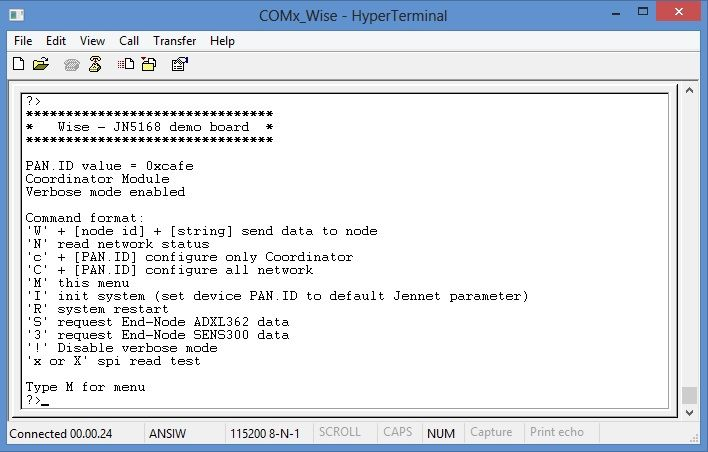

.. _ready:

**"Ready to run"** Wise Kit
***************************

**Ready to run** is a pre-programmed kit that perform basic function for Jennic evaluation purpose.
We can find two Wise board, first one as Coordinator and second as End-Node.

Working with Wise board
-----------------------

Simply use of Wise Board, is to plug Coordinator and End-Node on two USB port of your PC
See at com port configured, and then open two HyperTerminal sessions to evaluate Wise network

**Coordinator Serial Monitor main menu**

**End-Node Serial Monitor main menu**

.. image:: _jn_images/end_menu.jpg

By default, Coordinator has "verbose mode" enabled and End-Node has "auto send sensors data" enabled.
"Verbose mode" shows for every transaction (both TX and RX) more data detail, such as HEX format (enclosed in square bracket)
When verbose mode is disabled, Serial Monitor gets out only the string or data. It is useful to receive VCARD data from SerizII and save these in VCF format.

"Auto send sensors data" performs read&send sensors data (ADXL362 and SENS300), every time that End-Node receive a poll from Coordinator. When disabled, auto send function will not work.

.. note::

 *For more details about Serial Monitor, see* :ref:`monitor`

First Lab
=========

The Lab1 that you can perform, is by following the next steps:

- Connect Coordinator and End-Node Wise boards on USB port of your PC
- Open terminals, connect appropriate serial port and check correct settings (see  :ref:`hyper`)
- Wait for network connection (blue-led will flash fast both in Coordinator and End-Node)
- See at red-led flash (poll, trasmit or receive, default is 8 seconds)
- See at terminals windows: you can see regullary (every poll-time), both coordinator and end-node, details of sensors data trasmitted and received
- Disable End-Node "Auto send sensors data" typing command '**!**'.
- Change End-Node PAN.ID (i.e. 1234) typing '**C**' command. Board will restart and then wait for new Coordinator (blue-led flash slow)
- See blue-led of Coordinator board: when it flash slow, the Coordinator detect poll failure and automatically dissociate End-Node (it will take about 30-35 seconds). Serial monitor will inform when it occur.
- Now change Coordinator PAN.ID ('**C**' command) and set same as End-Node previously changed (i.e. 1234) Coordinator restarts itself.
- In a few seconds, End-Node will reassociate with new Coordinator and start to send sensors data.
- Enter End-Node sleep mode (typing **'Z'** command). When leds off, plug out End-Node. It will send every 15 seconds sensors data to Coordinator. In sleep-mode the power drain by the end-node is very low. You can take out from USB port and the End-node will run on the small supercap on the board for few minutes.

.. important::

 Sleep Wake Time can be set changing default definition in define.h file. For more information, read :ref:`sleep`

Lab 2 with SerizII
==================

The purpose af Lab2 is to show how to add a new end-node to an exhisting network, by setting authomatically the end-node PAN-ID to mach the exhisting network PAN-ID.
The processo is:
- the network is running ( coordinator on PC )
- the end-node to be added, which is the SerizII, will read the PAN-ID stored on the NTAG on the ccordinator.
- the end-node PAN-ID is set to the network PAN-ID
- data can be now exchanged by end node to coordinator, the Vcard data.

Wise board is designed as a SerizII plugin (see :ref:`seriz`). In Lab1, plug End-Node board on SerizII and Coordinator on USB port of your PC. 
If you want, you can connect Wise End-Node board, plugged on SerizII, to PC using USB type-A extension cable. Serial Monitor will run, without affecting SerizII communications.
Then, follow next steps:

- Open terminals, connect appropriate serial port and check correct settings (see  :ref:`hyper`)
- See SerizII display: it will inform that JN5168 End-Node is installed. 
- Wait for End-Node restart. See blue-leds flash, that will be slow. No network connection and no device associated. (You can also verify by typing **'N'** command on Coordinator serial monitor)
- If the PC serial monitor is connect to the End-Node, on main menu you can see that 'Auto send sensors data' is disabled, because of this is a default setting by SerizII connection.
- Take Coordinator near SerizII RFID antenna: the Seriz will read the Coordinator PAN.ID from the onboard Ntag. SerizII will update the End-Node PAN.ID. 
- End-Node will restart, and in a few seconds will be associated to the Coordinator.
- Blue-leds will flash fast to indicate that Network is connected, and also the SerizII display will show this.
- Disable verbose mode on the Coordinator (typing **'!'** command)
- Place the business card in near SerizII RFID antenna; see at Serial Monitor windows of Coordinator and you can see all data readed from business card.
- You can copy and paste business data (using NotePad) and save this file with extension **.vcf** and directly import to your contact database.

.. important::

 When End-Node is connected to SerizII, Sleep mode entering is not allowed. Even 'Auto send sensors data' is disabled, but you can enable it using '!' Serial Monitor command.

Lab 3 with SerizII
==================

The purpose af Lab3 is to show how to add a new end-node to an exhisting netwirk, by setting authomatically the end-node PAN-ID to mach the nexhisting network PAN-ID.
The processo is:
- the network is running ( ccordinator on SerizII )
- the default address of the end-node to be added is read by Seriz from the NTAG on the end-node
- the coordinator is set to the end-node read PAN-ID, to be able to comunicate with the end-nod to be added
- the end-node PAN-Id is set to the network PAN-ID
- the corrdinator is put back on the original networn PAN-ID, to which the end-node is now added

In Lab3, plug Coordinator on SerizII and End-Node on USB port of your PC. Simillary to Lab2, you can connect Wise Coordinator board, plugged on SerizII, to PC. After this, see here steps for Lab2.

- Open terminals, connect appropriate serial port and check correct settings (see  :ref:`hyper`)
- See SerizII display: it will inform that JN5168 Coordinator is installed.
- Wait for Coordinator restart: blue-led will flash slow, no network is connected.
- Take End-Node near SerizII RFID antenna: the Seriz will read the End-Node PAN.ID from the onboard Ntag. SerizII will update the Coordinator PAN.ID, wait for End-Node association and will perform update of End-Node PAN.ID to the previos network PAN.ID. 
- Wait for End-Node restart, and in a few seconds it will associate to the Coordinator.
- End-Node, every time that receive poll command, send sensors data to Coordinator. You can see these data both Coordinator and End-Node Serial Monitor windows 
- SerizII display show sensors data received and network state for each End-Node associated: short Network address and state (Sleep or not). You can verify also using Serial Monitor command **'N'**.
- Now place End-Node in 'Sleep mode': SerizII will show the End-Node new state (sleep) and receive (every Sleep Wake Time) End-Node sensors data.

.. important::

 Sleep Wake Time can be set changing default definition in define.h file. For more information, read :ref:`sleep`

After this 3 Labs, use :ref:`monitor` and enjoy with Wise Boards!!

