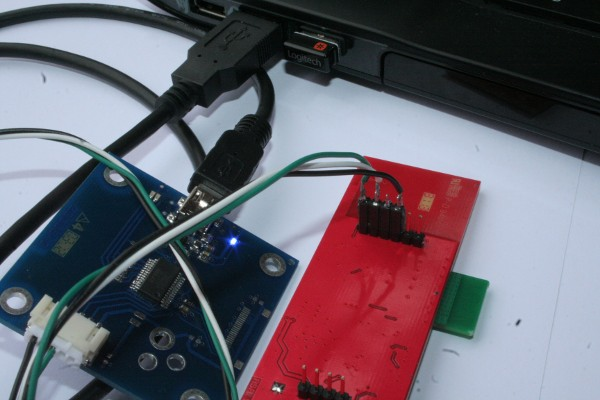
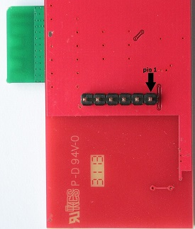
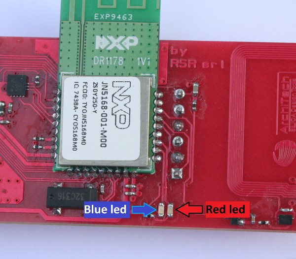

.. _tips:

Tip & Tricks
************

Stand-alone use of Wise Boards
------------------------------

| **"Ready to run" Wise boards** are designed to quick and fast evaluation with PC and SerizII board. 
| You can use the board both connected with PC for stand-alone evaluation or personal purpose.
| In this case, take care at USB com port installed for each board. 
| For full informations about, see :ref:`ready` 
|   
 
.. _serial:

Serial channel details
----------------------

For best developement purpose, you can change serial monitor out:

- USB to serial adapter (TTL out)
- Custom cable to connect 6 pin strip from Wise Board to USB serial adapter

::

 Wise 6 pin strip schematich

 pin 1 --> RxD TTL level
 pin 2 --> TxD TTL level
 pin 3 --> NC
 pin 4 --> GND
 pin 5 --> NC
 pin 6 --> RESET

 

How to change Serial Monitor out
================================

| At the top of **Wise_Coord.c** and **Wise_EndD** file you can find a variable statement 

*uint8 vprintf_uart = E_AHI_UART_0;* 
 
::

 /****************************************************************************/
 /***        Serial Monitor define                                         ***/
 /****************************************************************************/
   
 uint8 vprintf_uart = E_AHI_UART_0;
 
The Coordinator and End-Node, by default, use USB dongle serial channel (E_AHI_UART_0) for both programming and serial monitor.
You can change it to E_AHI_UART_1, and serial monitor will communicate using serial channel connected to 6 pin strip. 

.. important::

 Serial channel 1 (E_AHI_UART_1) is default communication channel to SerizII board. When you switch Wise Serial Monitor out to this channel, all SerizII communication functions will be disabled. The result of this change is the loss of functionality with SerizII
 
.. _sleep:

Poll and Sleep settings
-----------------------

In the file **define.h** you can find the Poll and Sleep settings. By defualt, polling is executed every 8 seconds, the number of maximum poll failure is 4. This gives a maximun non-response time equal to 32 seconds: if End-Node will not be found for this timing, Coordinator will disassociate it from Network. End-Node use instead a polling timeout, that is equal ((POLL_TIME * MAX_FAIL)+1) seconds, and by default gives a value of 33 seconds. 
Then, the time necessary for disassociation will be just over 30 seconds.

The Sleep time is by default 15 seconds: this means that every End-Node in sleep mode will awakes every 15 seconds, sends sensors data and will return in sleep mode. With this setting, the sleep mode has a duration of 6-8 minutes. After this time, the device dies. You can change the Sleep Time definition and make it more great to obtain a more long device life.

When in Sleep-mode, if End-Node will not find a valid Coordinator for SLEEP_RETRY times, stops itself with Blue-Led on. By default, this gives End_Node timeout equal to 45 seconds. After this time, After this time, End-Node lights up Blue-Led and let it die. You can change number of SLEEP_RETRY in order to have more retry (only during sleep mode)

::

 /******************************************************************
 * SLEEP and POLL SETTINGS
 *****************************************************************/

 // POLL definition --> leave before MAX_SLEEP_FAIL definition
 // Coordinator
 #define POLL_TIME ONE_SEC*8
 #define MAX_FAIL 4
 // End-Node
 #define POLL_TIMEOUT (POLL_TIME * MAX_FAIL)+ONE_SEC
 
 //End-Node SLEEP MODE time definition --> seconds - leave before MAX_SLEEP_FAIL definition
 #define SLEEP_TIME 15
 
 //Max End-Node sending retry --> only valid in sleep mode
 #define SLEEP_RETRY 3

 //Coordinator SLEEP MODE fail definition
 #if ((SLEEP_TIME*MAX_FAIL) >= ((POLL_TIME/ONE_SEC)*MAX_FAIL))
 #define MAX_SLEEP_FAIL ((SLEEP_TIME*MAX_FAIL)/(POLL_TIME/ONE_SEC)+1)
 #else
 #define MAX_SLEEP_FAIL = MAX_FAIL
 #endif 

Led functions
-------------

Wise board has 2 LEDs, one blue and one red, which indicate the following features

**Coordinator**

- Blue led, slow lamp --> network scanning active, no devices associated
- Blue led, fast lamp --> network ready, almost one device associated
- Red led --> flashing to indicate radio Rx/Tx

**End-Node** 

- Blue led, slow lamp --> ready to associate, no network or coordinator found
- Blue led, fast lamp --> network ready, device associated (coordinator found)
- Blue led, on --> sleep fail, no coordinator found
- Red led --> flashing to indicate radio Rx/Tx

Firmware debugging
------------------

**JN5168 modules does't support Jtag emulation. If you need to develope new application, you can use "vPrintf" function.**